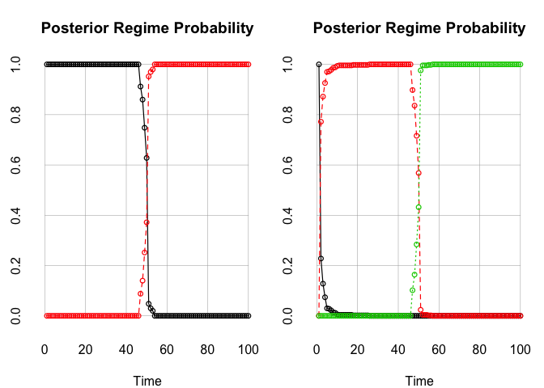
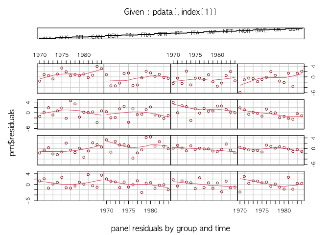
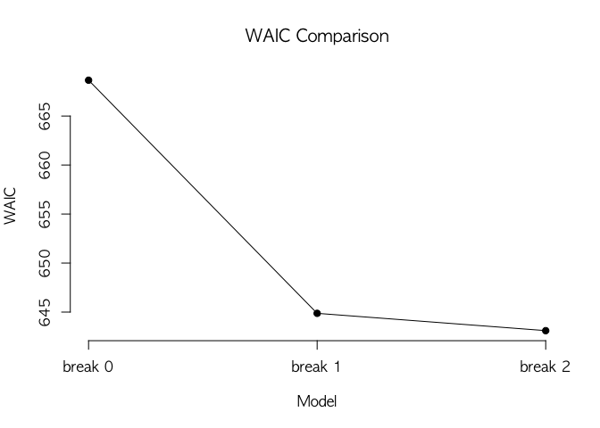
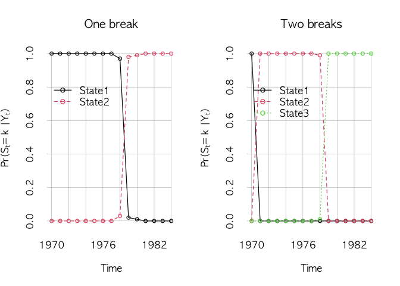
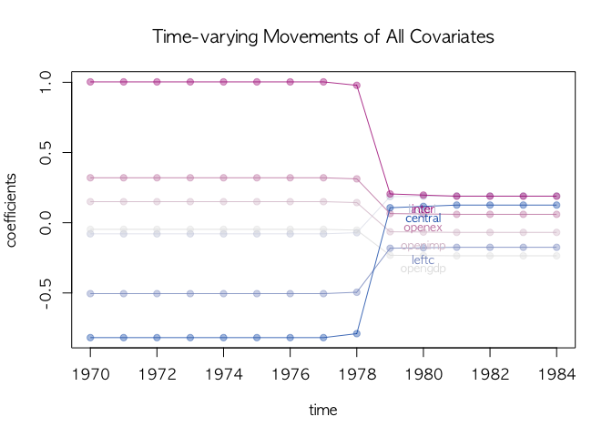
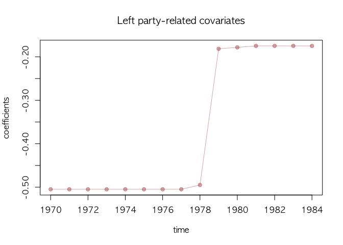

<!-- README.md is generated from README.Rmd. Please edit that file -->

# BridgeChange

`R` package `BridgeChange` constains functions useful to analyze
time-series data and panel data with possibly large number of covariates
and change-points. This package offers a Bayesian inference on the
linear regression mode under high-dimensinal covariates whose effects on
the outcome are allowed to be heterogeneous across time. This package
will be useful to discover a set of predictive variables under dynamic
setting where time-varying effect is expected to exist in many cases.

## Installation

You can install the most recent version of `BridgeChange` from Gitub
using the [`devtools`](https://github.com/r-lib/devtools) package.

``` r
# install BridgeChange from Github
# you might need to instal "devtools"
devtools::install_github("jongheepark/BridgeChange")
#> Downloading GitHub repo jongheepark/BridgeChange@HEAD
#> collapse (1.7.5 -> 1.7.6) [CRAN]
#> Installing 1 packages: collapse
#> Installing package into '/Users/park/.R/packages'
#> (as 'lib' is unspecified)
#> 
#>   There is a binary version available but the source version is later:
#>          binary source needs_compilation
#> collapse  1.7.5  1.7.6              TRUE
#> installing the source package 'collapse'
#> Warning in i.p(...): installation of package 'collapse' had non-zero exit status
#>      checking for file ‘/private/var/folders/tf/xj58_m8146s8_tsg2989y7p80000gn/T/RtmpXSStBH/remotes543210316b5c/jongheepark-BridgeChange-fbc7a23/DESCRIPTION’ ...  ✓  checking for file ‘/private/var/folders/tf/xj58_m8146s8_tsg2989y7p80000gn/T/RtmpXSStBH/remotes543210316b5c/jongheepark-BridgeChange-fbc7a23/DESCRIPTION’
#>   ─  preparing ‘BridgeChange’:
#>      checking DESCRIPTION meta-information ...  ✓  checking DESCRIPTION meta-information
#>   ─  cleaning src
#>   ─  checking for LF line-endings in source and make files and shell scripts
#>   ─  checking for empty or unneeded directories
#>   ─  building ‘BridgeChange_1.4.tar.gz’
#>      
#> 
#> Installing package into '/Users/park/.R/packages'
#> (as 'lib' is unspecified)
```

## Alvarez et al. data

## Fit the one-way (time) fixed effect model using plm

The following two `model` arguments are availabel for the fixed-effects
HMBB. - the fixed effects model (`"within"`), the default, - the pooling
model (`"pooling"`),

We will use the one-way (time) fixed effect model because the original
model has a time-invariant covariate (central).

``` r
model = "within"
index = c('country', 'year')
effect = 'time'
formula <- growth ~ lagg1 + opengdp + openex + openimp + leftc * central
pdata   <- pdata.frame(data, index)
pm <- plm(formula, data = pdata, model = model, effect = effect)
summary(pm)
#> Oneway (time) effect Within Model
#> 
#> Call:
#> plm(formula = formula, data = pdata, effect = effect, model = model)
#> 
#> Balanced Panel: n = 16, T = 15, N = 240
#> 
#> Residuals:
#>      Min.   1st Qu.    Median   3rd Qu.      Max. 
#> -5.837357 -1.197473  0.067401  1.170477  4.529090 
#> 
#> Coefficients:
#>                  Estimate  Std. Error t-value  Pr(>|t|)    
#> lagg1          0.05031487  0.13920445  0.3614 0.7181162    
#> opengdp       -0.00233019  0.00186733 -1.2479 0.2134164    
#> openex         0.00200753  0.00120757  1.6625 0.0978586 .  
#> openimp       -0.00060892  0.00167894 -0.3627 0.7171955    
#> leftc         -0.02471232  0.00927578 -2.6642 0.0082944 ** 
#> central       -0.76356330  0.21625824 -3.5308 0.0005055 ***
#> leftc:central  0.01286831  0.00361409  3.5606 0.0004542 ***
#> ---
#> Signif. codes:  0 '***' 0.001 '**' 0.01 '*' 0.05 '.' 0.1 ' ' 1
#> 
#> Total Sum of Squares:    809.01
#> Residual Sum of Squares: 718.43
#> R-Squared:      0.11196
#> Adj. R-Squared: 0.026415
#> F-statistic: 3.92636 on 7 and 218 DF, p-value: 0.00046809
```

## Inspect the model (response and residuals)

We take a look at the response data and panel residuals to check the
sign of misfit due to time-varying effects.

``` r
## response
plot(pdata$growth)
```



``` r

## panel residuals
coplot(pm$residuals ~ pdata[,index[2]]|pdata[,index[1]], data=pdata, ## number=length(unique(pdata[,index[1]])),
       overlap=.1, col="brown", type="l", 
       panel = panel.smooth, xlab="panel residuals by group and time")
```



## Fitting HMBB

We fit three HMBBs with no break, one break, and two breaks to see
whether effects of covariates change over time. To save time, we set
mcmc = 100 here. `BridgeFixedPanel` transforms the panel data using
`plm` arguments of `model`, `effect` and `index` first. Then, it fits
HMBB on the transformed data. `n.break` sets the number of break to be
estimated.

``` r
mcmc = 100; burn = 100; verbose = 100; thin = 1;
formula <- growth ~ lagg1 + opengdp + openex + openimp + leftc + central + inter
agl.cp0 <- BridgeFixedPanel(formula=formula, data = data, 
                            model = model, index = index, effect = effect,
                            mcmc=mcmc, verbose=verbose, Waic = TRUE, 
                            n.break = 0)
#> Initializing betas by SLOG
#> ----------------------------------------------------
#> MCMC SparseChangeMixedPanel Sampler Starts! 
#> Initial state =  15 
#> ----------------------------------------------------
#> 
#> ---------------------------------------------- 
#> ## iteration =  100 
#> ---------------------------------------------- 
#> beta:   0.0019 -0.2741  0.0991  0.1055 -0.4680 -0.1523  0.6372 
#> 
#> ---------------------------------------------- 
#> ## iteration =  200 
#> ---------------------------------------------- 
#> beta:   0.054 -0.146  0.638 -0.304 -0.480 -0.395  0.740 
#> 
#> ---------------------------------------------- 
#>  Likelihood computation 
#>     loglike:  -326.3751 
#> ---------------------------------------------- 
#>  
#> ---------------------------------------------- 
#>  Waic:  668.6554 
#>  run time:  0.826 
#> ----------------------------------------------
agl.cp1 <- BridgeFixedPanel(formula=formula, data = data, 
                            model = model, index = index, effect = effect,
                            mcmc=mcmc, verbose=verbose, Waic = TRUE, 
                            n.break = 1)
#> Initializing betas by SLOG
#> ----------------------------------------------------
#> MCMC SparseChangeMixedPanel Sampler Starts! 
#> Initial state =  9 6 
#> ----------------------------------------------------
#> 
#> ---------------------------------------------- 
#> ## iteration =  100 
#> ---------------------------------------------- 
#> sampled states:  9 6 
#> beta at state  1 :  -0.131 -0.070  0.466  0.038 -0.231 -0.863  0.746 
#> beta at state  2 :   0.33 -0.14 -0.55  0.47 -0.17  0.38 -0.10 
#> 
#> ---------------------------------------------- 
#> ## iteration =  200 
#> ---------------------------------------------- 
#> sampled states:  9 6 
#> beta at state  1 :  -0.157 -0.315  0.047  0.739 -0.689 -0.883  1.278 
#> beta at state  2 :   0.34 -0.11 -0.63  0.34  0.20  0.32 -0.31 
#> 
#> ---------------------------------------------- 
#>  Likelihood computation 
#>     loglike:  -308.8235 
#> ---------------------------------------------- 
#>  
#> ---------------------------------------------- 
#>  Waic:  644.8722 
#>  run time:  1.703 
#> ----------------------------------------------
agl.cp2 <- BridgeFixedPanel(formula=formula, data = data, 
                            model = model, index = index, effect = effect,
                            mcmc=mcmc, verbose=verbose, Waic = TRUE, 
                            n.break = 2)
#> Initializing betas by SLOG
#> ----------------------------------------------------
#> MCMC SparseChangeMixedPanel Sampler Starts! 
#> Initial state =  5 5 5 
#> ----------------------------------------------------
#> 
#> ---------------------------------------------- 
#> ## iteration =  100 
#> ---------------------------------------------- 
#> sampled states:  1 8 6 
#> beta at state  1 :   0.803 -0.091 -0.469  0.039 -0.146  0.324 -0.242 
#> beta at state  2 :  -0.054 -0.155  0.173  0.444 -0.727 -1.020  1.384 
#> beta at state  3 :   0.198 -0.417  0.513 -0.449 -0.176  0.143  0.052 
#> 
#> ---------------------------------------------- 
#> ## iteration =  200 
#> ---------------------------------------------- 
#> sampled states:  1 8 6 
#> beta at state  1 :   0.120  0.212  0.857  0.316  0.293 -0.445  0.035 
#> beta at state  2 :  -0.093 -0.006  0.297  0.239 -0.598 -0.894  1.154 
#> beta at state  3 :   0.2156 -0.0015  0.3987 -0.4935 -0.1998  0.0900  0.1940 
#> 
#> ---------------------------------------------- 
#>  Likelihood computation 
#>     loglike:  -303.582 
#> ---------------------------------------------- 
#>  
#> ---------------------------------------------- 
#>  Waic:  643.1039 
#>  run time:  2.42 
#> ----------------------------------------------
```

After fitting multiple models, we can compare their model-fits using
WAIC. `WaicCompare` shows WAIC scores for a list of models. `plotWaic()`
draws a plot of WAIC scores.

``` r
## model selection by WAIC
waic <- WaicCompare(list(agl.cp0, agl.cp1, agl.cp2), print = TRUE)
#> 
#> Selected model = break 2 
#> 
#> [1] 668.66 644.87 643.10
plotWaic(waic)
```



In addition to WAIC, we compare transitions of hidden states.
`plotState` in MCMCpack can be used to draw hidden state transitions.

``` r
## state changes
par(mfrow=c(1, 2))
plotState(agl.cp1, start=1970, legend.control =c(1970, 0.85), main="One break")
plotState(agl.cp2, start=1970, legend.control =c(1970, 0.85), main="Two breaks")
```



The one break model looks good. We check the time-varying movements of
the one break model using `dotplotRegime()`. Colors in `dotplotRegime()`
are determined by the size of coefficients in the first regime. Red
means positive, blue means negative, and grey means close to 0 in the
first regime.

``` r
## all covariates
dotplotRegime(agl.cp1, hybrid=FALSE, start = 1970, location.bar=12, x.location="default",
              text.cex=0.8, main="Time-varying Movements of All Covariates")
```



``` r
## label as a legend
dotplotRegime(agl.cp1, hybrid=FALSE, start = 1970, location.bar=12, x.location="legend",
              text.cex=0.8, main="Time-varying Movements of All Covariates")
```


We visualize the movement of the selected covariate using `select`
argument in `dotplotRegime()`. Here we choose the left-party
government-related variable.

``` r
## leftc only
## select works like grep()
dotplotRegime(agl.cp1, hybrid=FALSE, start = 1970, location.bar=12, x.location="static",
              text.cex=0.8, select="left", main=("Left party-related covariates"))
```


