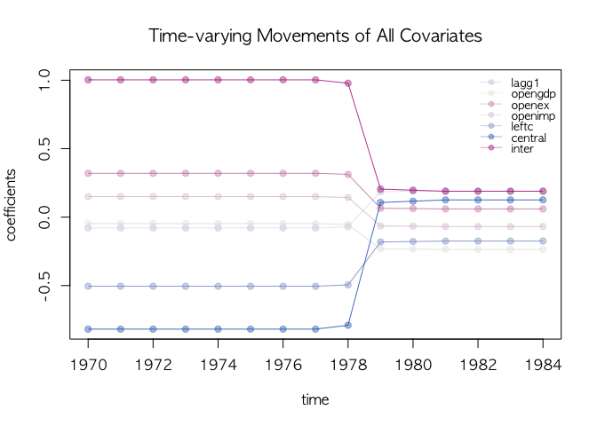
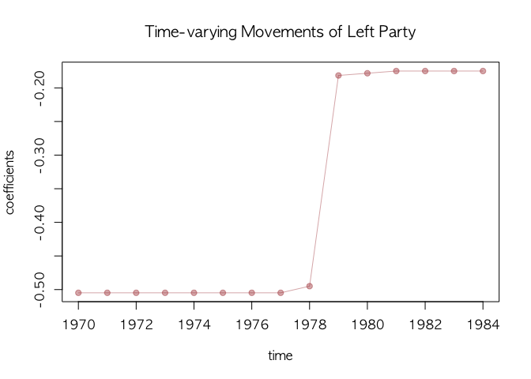

<!-- README.md is generated from README.Rmd. Please edit that file -->

# BridgeChange

`R` package `BridgeChange` constains functions useful to analyze
time-series data and panel data with possibly large number of covariates
and change-points. This package offers a Bayesian inference on the
linear regression mode under high-dimensinal covariates whose effects on
the outcome are allowed to be heterogeneous across time. This package
will be useful to discover a set of predictive variables under dynamic
setting where time-varying effect is expected to exist in many cases.

## Installation

You can install the most recent version of `BridgeChange` from Gitub
using the [`devtools`](https://github.com/r-lib/devtools) package.

``` r
# install BridgeChange from Github
# you might need to instal "devtools"
devtools::install_github("soichiroy/BridgeChange")
#> Skipping install of 'BridgeChange' from a github remote, the SHA1 (8b759e0d) has not changed since last install.
#>   Use `force = TRUE` to force installation
```

## Alvarez et al. data

## Inspect data by looking at residuals

``` r
pdata   <- pdata.frame(data, index)
pm <- plm(formula, data = pdata, model = model, effect = effect)
                                        # 
## plot panel residuals
coplot(pm$residuals ~ pdata[,index[2]]|pdata[,index[1]], data=pdata, ## number=length(unique(pdata[,index[1]])),
       overlap=.1, col="brown", type="l", 
       panel = panel.smooth, xlab="panel residuals by group and time")
```


## Fitting HMBB

``` r
mcmc = 100; burn = 100; verbose = 100; thin = 1;
formula <- growth ~ lagg1 + opengdp + openex + openimp + leftc + central + inter
agl.cp0 <- BridgeFixedPanel(formula=formula, data = data, 
                            model = model, index = index, effect = effect,
                            mcmc=mcmc, verbose=verbose, Waic = TRUE, 
                            n.break = 0)
#> Initializing betas by SLOG
#> ----------------------------------------------------
#> MCMC SparseChangeMixedPanel Sampler Starts! 
#> Initial state =  15 
#> ----------------------------------------------------
#> 
#> ---------------------------------------------- 
#> ## iteration =  100 
#> ---------------------------------------------- 
#> beta:   0.0019 -0.2741  0.0991  0.1055 -0.4680 -0.1523  0.6372 
#> 
#> ---------------------------------------------- 
#> ## iteration =  200 
#> ---------------------------------------------- 
#> beta:   0.054 -0.146  0.638 -0.304 -0.480 -0.395  0.740 
#> 
#> ---------------------------------------------- 
#>  Likelihood computation 
#>     loglike:  -326.3751 
#> ---------------------------------------------- 
#>  
#> ---------------------------------------------- 
#>  Waic:  668.6554 
#>  run time:  0.851 
#> ----------------------------------------------
agl.cp1 <- BridgeFixedPanel(formula=formula, data = data, 
                            model = model, index = index, effect = effect,
                            mcmc=mcmc, verbose=verbose, Waic = TRUE, 
                            n.break = 1)
#> Initializing betas by SLOG
#> ----------------------------------------------------
#> MCMC SparseChangeMixedPanel Sampler Starts! 
#> Initial state =  9 6 
#> ----------------------------------------------------
#> 
#> ---------------------------------------------- 
#> ## iteration =  100 
#> ---------------------------------------------- 
#> sampled states:  9 6 
#> beta at state  1 :  -0.131 -0.070  0.466  0.038 -0.231 -0.863  0.746 
#> beta at state  2 :   0.33 -0.14 -0.55  0.47 -0.17  0.38 -0.10 
#> 
#> ---------------------------------------------- 
#> ## iteration =  200 
#> ---------------------------------------------- 
#> sampled states:  9 6 
#> beta at state  1 :  -0.157 -0.315  0.047  0.739 -0.689 -0.883  1.278 
#> beta at state  2 :   0.34 -0.11 -0.63  0.34  0.20  0.32 -0.31 
#> 
#> ---------------------------------------------- 
#>  Likelihood computation 
#>     loglike:  -308.8235 
#> ---------------------------------------------- 
#>  
#> ---------------------------------------------- 
#>  Waic:  644.8722 
#>  run time:  1.747 
#> ----------------------------------------------
agl.cp2 <- BridgeFixedPanel(formula=formula, data = data, 
                            model = model, index = index, effect = effect,
                            mcmc=mcmc, verbose=verbose, Waic = TRUE, 
                            n.break = 2)
#> Initializing betas by SLOG
#> ----------------------------------------------------
#> MCMC SparseChangeMixedPanel Sampler Starts! 
#> Initial state =  5 5 5 
#> ----------------------------------------------------
#> 
#> ---------------------------------------------- 
#> ## iteration =  100 
#> ---------------------------------------------- 
#> sampled states:  1 8 6 
#> beta at state  1 :   0.803 -0.091 -0.469  0.039 -0.146  0.324 -0.242 
#> beta at state  2 :  -0.054 -0.155  0.173  0.444 -0.727 -1.020  1.384 
#> beta at state  3 :   0.198 -0.417  0.513 -0.449 -0.176  0.143  0.052 
#> 
#> ---------------------------------------------- 
#> ## iteration =  200 
#> ---------------------------------------------- 
#> sampled states:  1 8 6 
#> beta at state  1 :   0.120  0.212  0.857  0.316  0.293 -0.445  0.035 
#> beta at state  2 :  -0.093 -0.006  0.297  0.239 -0.598 -0.894  1.154 
#> beta at state  3 :   0.2156 -0.0015  0.3987 -0.4935 -0.1998  0.0900  0.1940 
#> 
#> ---------------------------------------------- 
#>  Likelihood computation 
#>     loglike:  -303.582 
#> ---------------------------------------------- 
#>  
#> ---------------------------------------------- 
#>  Waic:  643.1039 
#>  run time:  2.524 
#> ----------------------------------------------
```

``` r
## model selection by WAIC
waic <- WaicCompare(list(agl.cp0, agl.cp1, agl.cp2), print = TRUE)
#> 
#> Selected model = break 2 
#> 
#> [1] 668.66 644.87 643.10
plotWaic(waic)
```


``` r

## state changes
par(mfrow=c(1, 2))
plotState(agl.cp1, start=1970, legend.control =c(1970, 0.85), main="One break")
plotState(agl.cp2, start=1970, legend.control =c(1970, 0.85), main="Two breaks")
```


``` r
## all covariates
dotplotRegime(agl.cp1, hybrid=FALSE, start = 1970, location.bar=12, x.location="default",
              text.cex=0.8, main="Time-varying Movements of All Covariates")
```


``` r
## label as a legend
dotplotRegime(agl.cp1, hybrid=FALSE, start = 1970, location.bar=12, x.location="legend",
              text.cex=0.8, main="Time-varying Movements of All Covariates")
```



``` r

## leftc only
## select works like grep()
dotplotRegime(agl.cp1, hybrid=FALSE, start = 1970, location.bar=12, x.location="static",
              text.cex=0.8, select="left", main=("Time-varying Movements of Left Party"))
```


