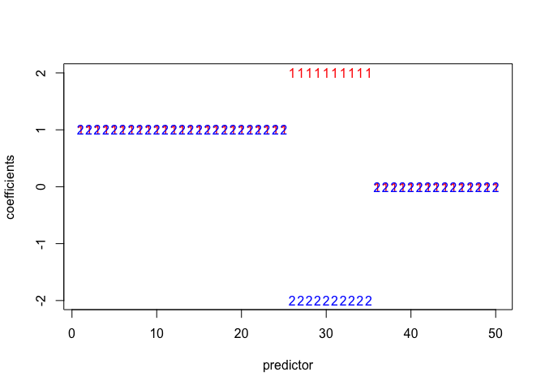
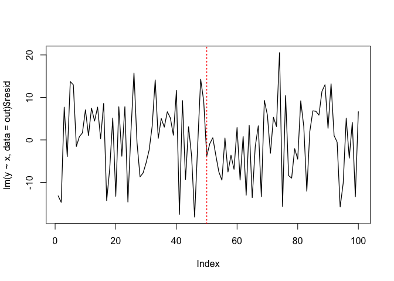

<!-- README.md is generated from README.Rmd. Please edit that file -->
BridgeChange
============

`R` package `BridgeChange` constains functions useful to analyze time-series data and panel data with possibly large number of covariates and change-points. This package offers a Bayesian inference on the linear regression mode under high-dimensinal covariates whose effects on the outcome are allowed to be heterogeneous across time. This package will be useful to discover a set of predictive variables under dynamic setting where time-varying effect is expected to exist in many cases.

Table of Contents
-----------------

1.  [Overview](#overview)
2.  [Installation](#installation)
3.  [Time-series Data](#time-series-data)

Installation
------------

You can install the most recent version of `BridgeChange` from Gitub using the [`devtools`](https://github.com/r-lib/devtools) package.

``` r
# install BridgeChange from Github
# you might need to instal "devtools"
devtools::install_github("soichiroy/BridgeChange")
```

Time-series Data
----------------

### Model

`BridgeChangeReg()` can be used to analyse time-series data with possible change-points.

The functions fits the linear model:
*y*<sub>*t*</sub> = **X**<sub>*t*</sub><sup>⊤</sup>*β*<sub>*s*<sub>*t*</sub></sub> + *ϵ*<sub>*t*</sub>
 where *s*<sub>*t*</sub> ∈ {1, …, *M*} is an indicator of states.

### Example

``` r
set.seed(1973);

##
## simulate dataset 
##

out <- BridgeChangeSim(ntime=100, predictor = 50, rho=0.2, constant.p = 0.5,
                       positive.jump=FALSE, varying.p = 0.2, break.point = 0.5, dgp.only=TRUE)
#> Loading required package: glmnet
#> Loading required package: Matrix
#> 
#> Attaching package: 'Matrix'
#> The following object is masked from 'package:tidyr':
#> 
#>     expand
#> Loading required package: foreach
#> Loaded glmnet 2.0-16

# plot simulated coefficients 
plot(1:length(out$true.beta[1,]), out$true.beta[1,], 
     xlab="predictor", ylab="coefficients", ylim=range(out$true.beta), type='n')
points(out$true.beta[1,], col="red", pch="1", cex=1)
points(out$true.beta[2,], col="blue", pch="2", cex=1)
```



``` r

# plot simulated data 
plot(lm(y ~ x, data = out)$resid, type = 'l', lwd = 1.3)
abline(v = 100/2, col = 'red', lty = 3, lwd = 1.5)
```



``` r
##
## fit models 
##

# set mcmc parameters 
mcmc <- burn <- 500; thin <- 1; verbose <- 500

# fit no-break model
set.seed(11173)
out0 <- BridgeChangeReg(y=out$y, X=out$x, scale.data=TRUE, intercept=TRUE,
                        mcmc=mcmc, burn = burn, thin=thin, verbose=verbose,
                        alpha.MH=TRUE, n.break = 0, waic=TRUE)
#> 
#> ----------------------------------------------------
#> MCMC Sampling of BridgeChangeReg Starts! 
#> ----------------------------------------------------
#> 
 Estimating parameters. Now at 500 of 1000
 Estimating parameters. Now at 1000 of 1000
#> ----------------------------------------------------
#> WAIC:  242.6075 
#> Run time:  7.557 
#> ----------------------------------------------------

# fit one-break model 
set.seed(11173)
out1 <- BridgeChangeReg(y=out$y, X=out$x, scale.data=TRUE,intercept=TRUE,
                        mcmc=mcmc, burn = burn, thin=thin, verbose=verbose,
                        alpha.MH=TRUE, n.break = 1, waic=TRUE)
#> 
#> ----------------------------------------------------
#> MCMC Sampling of BridgeChangeReg Starts! 
#> Initial state =  37 63 
#> ----------------------------------------------------
#> 
 Estimating parameters. Now at 500 of 1000
 Estimating parameters. Now at 1000 of 1000
#> ----------------------------------------------------
#> WAIC:  31.34521 
#> Run time:  13.055 
#> ----------------------------------------------------

# fit one-break model 
set.seed(11173)
out2 <- BridgeChangeReg(y=out$y, X=out$x, scale.data=TRUE,intercept=TRUE,
                        mcmc=mcmc, burn = burn, thin=thin, verbose=verbose,
                        alpha.MH=TRUE, n.break = 2, waic=TRUE)
#> 
#> ----------------------------------------------------
#> MCMC Sampling of BridgeChangeReg Starts! 
#> Initial state =  27 32 41 
#> ----------------------------------------------------
#> 
 Estimating parameters. Now at 500 of 1000
 Estimating parameters. Now at 1000 of 1000
#> ----------------------------------------------------
#> WAIC:  56.21819 
#> Run time:  18.103 
#> ----------------------------------------------------
```

``` r
##
## Post-estimation 
##

# model selection by waic 
waic <- WaicCompare(list(out0, out1, out2), print = TRUE)
#> 
#> Selected model = break 1 
#> 
#> break 0 break 1 break 2 
#> 242.607  31.345  56.218


# state transition plot (provided by `MCMCpack`)
par(mfrow = c(1,2), mar = c(4, 2.5, 3.5, 1))
MCMCpack::plotState(out1)
MCMCpack::plotState(out2)
```


